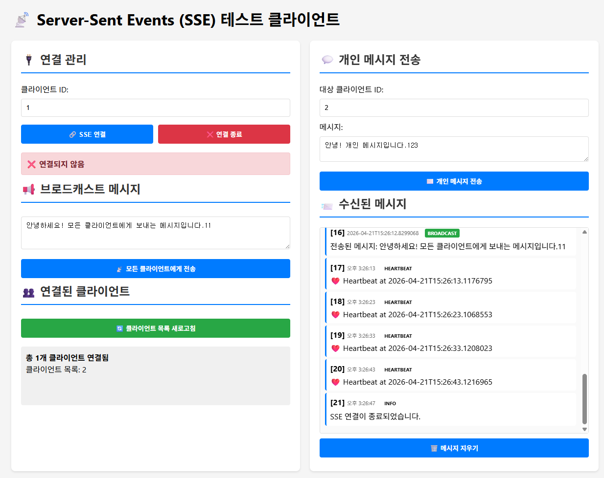
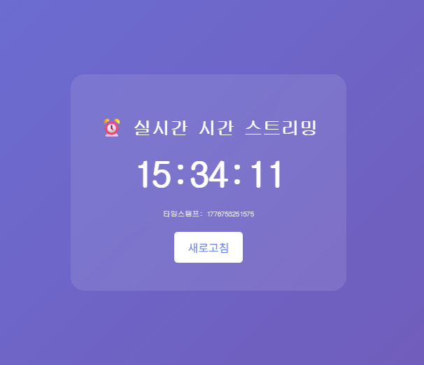

# SSE Project

Server-Sent Events (SSE)를 활용한 실시간 메시징 시스템입니다. Spring Boot 기반으로 구축되었으며, 클라이언트와 서버 간의 양방향 통신을 지원합니다.

## 기능

- **실시간 연결 관리**: 클라이언트의 SSE 연결을 관리하고, 연결 상태를 모니터링합니다.
- **브로드캐스트 메시징**: 모든 연결된 클라이언트에게 메시지를 동시에 전송합니다.
- **개인 메시지 전송**: 특정 클라이언트에게 직접 메시지를 보낼 수 있습니다.
- **하트비트 전송**: 10초마다 모든 클라이언트에게 하트비트를 전송하여 연결 상태를 유지합니다.
- **실시간 시간 스트리밍**: 서버의 현재 시간을 실시간으로 스트리밍합니다.
- **웹 인터페이스**: Thymeleaf 기반의 사용자 친화적인 웹 클라이언트를 제공합니다.

## 기술 스택

- **Backend**: Spring Boot 3.5.13
- **Language**: Java 21
- **Template Engine**: Thymeleaf
- **Build Tool**: Gradle
- **Frontend**: HTML, CSS, JavaScript (Vanilla JS)

## 설치 및 실행

### 사전 요구사항

- Java 21 이상
- Gradle (또는 Gradle Wrapper 사용)

### 실행 방법

1. 프로젝트 클론 또는 다운로드
2. 터미널에서 프로젝트 루트 디렉토리로 이동
3. 다음 명령어 실행:

```bash
./gradlew bootRun
```

4. 브라우저에서 `http://localhost:8080` 접속
5. 브라우저에서 `http://localhost:8080/time` 접속

## API 엔드포인트

### SSE 연결
- `GET /api/sse/connect?clientId={optional}`: 클라이언트를 SSE 스트림에 연결합니다. clientId가 제공되지 않으면 자동 생성됩니다.

### 메시징
- `POST /api/sse/broadcast`: 모든 연결된 클라이언트에게 메시지를 브로드캐스트합니다.
  - Body: `{"message": "메시지 내용"}`
- `POST /api/sse/send/{clientId}`: 특정 클라이언트에게 메시지를 전송합니다.
  - Body: `{"message": "메시지 내용"}`

### 정보 조회
- `GET /api/sse/clients`: 현재 연결된 클라이언트 목록을 조회합니다.
- `GET /api/sse/time`: 서버 시간을 실시간으로 스트리밍합니다.

### 웹 페이지
- `GET /`: 메인 SSE 테스트 클라이언트 페이지
- `GET /time`: 실시간 시간 스트리밍 페이지

## 사용 방법

1. 메인 페이지(`http://localhost:8080`)에서 "SSE 연결" 버튼을 클릭하여 서버에 연결합니다.
2. 연결 후 클라이언트 ID가 표시되며, 메시지를 수신할 수 있습니다.
3. 브로드캐스트 메시지 섹션에서 모든 클라이언트에게 메시지를 보낼 수 있습니다.
4. 개인 메시지 섹션에서 특정 클라이언트 ID를 지정하여 개인 메시지를 전송할 수 있습니다.
5. 시간 스트리밍 페이지(`http://localhost:8080/time`)에서 서버 시간을 실시간으로 확인할 수 있습니다.



## 프로젝트 구조

```
src/
├── main/
│   ├── java/
│   │   └── com/example/sseproject/
│   │       ├── SseProjectApplication.java          # 메인 애플리케이션 클래스
│   │       ├── controller/
│   │       │   ├── PageController.java             # 웹 페이지 컨트롤러
│   │       │   └── SseController.java              # SSE API 컨트롤러
│   │       └── dto/
│   │           ├── BroadcastResult.java
│   │           ├── HeartbeatEvent.java
│   │           ├── MessageRequest.java
│   │           ├── SendResult.java
│   │           ├── SseEvent.java
│   │           ├── TimeEvent.java
│   │           └── (기타 DTO 클래스들)
│   └── resources/
│       ├── application.yml                        # 애플리케이션 설정
│       ├── static/                                # 정적 리소스
│       └── templates/
│           ├── index.html                         # 메인 테스트 클라이언트
│           └── time.html                          # 시간 스트리밍 페이지
└── test/
    └── java/
        └── com/example/sseproject/
            └── SseProjectApplicationTests.java    # 테스트 클래스
```
